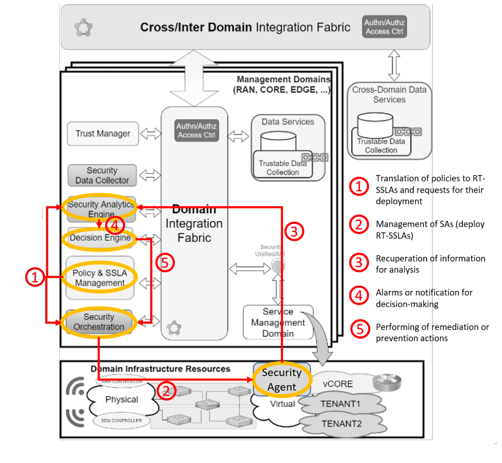
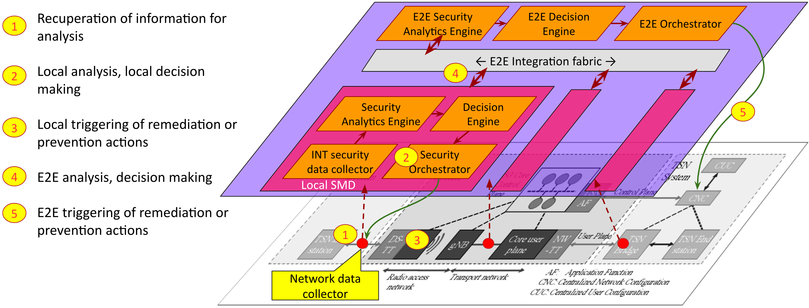

# Security Solution for Deterministic Applications on 6G Networks

This page contains source code of components in the Montimage's security solutions for Deterministic6G research [project](https://deterministic6g.eu/).

# Objective: Security by design
- Real-time traffic monitoring
- Real-time analysis and reasoning
- Remediation mechanism

# Architecture

- Local & End-to-End Security Management Domains
- Realtime ZSM closed-loop: monitoring – detection – reaction

## High-level Architecture

## An Implementation Architecture for Time-sensitive networks

# Components

Please refer to each component's document for further installation & usage:

- [INT in P4](./int-p4) 
- [INT data collector](./int-collector)(an extension of MMT-Probe)
- [Non-disruptive monitoring](./mmt-probe)
- [Signature-based security detection](./mmt-security)
- [Network traffic attack generation](./5greplay)

